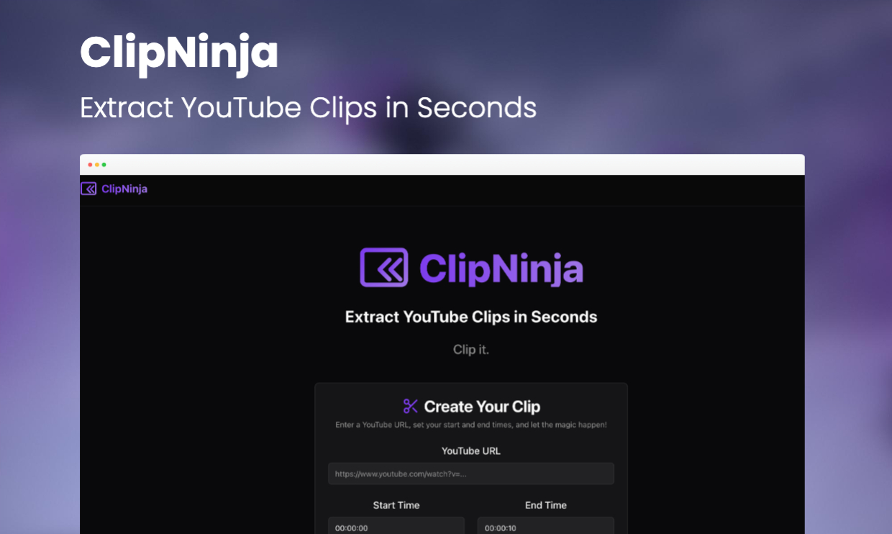
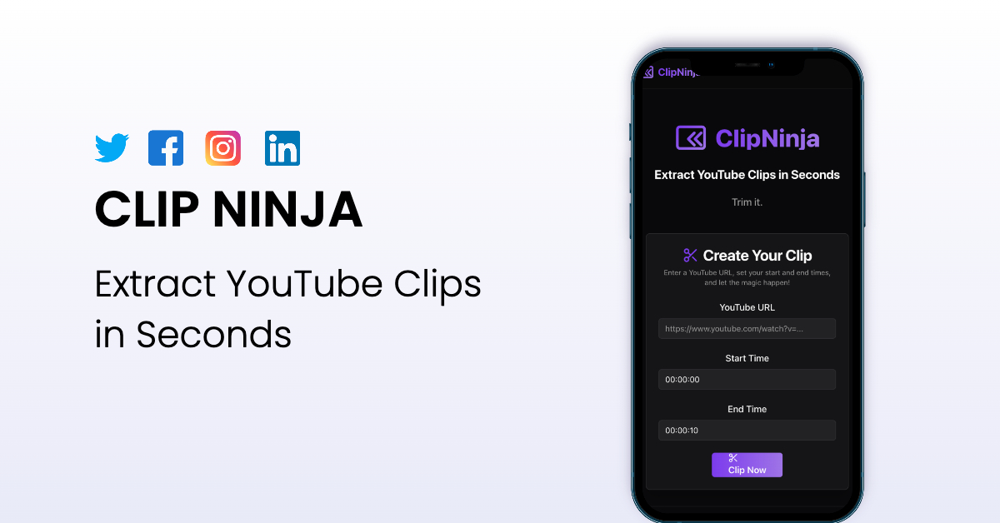

# ClipNinja ✂️🎬

<p align="center">
  
</p>

<p align="center">
  <b>Extract YouTube Clips in Seconds</b>
</p>

---

ClipNinja is a modern web application that lets you extract specific clips from YouTube videos by simply pasting a YouTube URL and selecting a start and end time. With a sleek, responsive UI and fast server-side processing, you can preview and download your favorite moments in just a few clicks.

---

## 🚀 Features

- 🎯 **Easy Clip Selection:** Paste a YouTube URL, set start and end times, and clip!
- ⚡ **Server-Side Processing:** Uses `ytdl-core` and `fluent-ffmpeg` for fast, reliable video trimming.
- 👀 **Preview & Download:** Instantly preview your clip and download it.
- 🖤 **Modern UI:** Dark theme, glassmorphism, smooth animations, and gradient accents.
- 📱 **Responsive Design:** Works beautifully on desktop, tablet, and mobile.

---

## 🛠️ Tech Stack

- **Frontend:** Next.js (App Router), React.js, Tailwind CSS, Framer Motion, ShadCN UI
- **Backend:** Next.js Server Actions & Route Handlers, Node.js runtime
- **Video Processing:** `ytdl-core`, `fluent-ffmpeg`

---

## 📸 Demo


<p align="center">
  
</p>

---

## ⚡ Getting Started

### Prerequisites

- **Node.js** (v18.18.0 or newer recommended)
- **npm** or **yarn**
- **FFmpeg** (required for video processing)
    - **macOS:** `brew install ffmpeg`
    - **Windows:** [Download from FFmpeg.org](https://ffmpeg.org/download.html) and add to PATH
    - **Linux:** `sudo apt update && sudo apt install ffmpeg`
    - _Verify installation with:_ `ffmpeg -version`

### Installation

```bash
# Clone the repository
git clone <repository-url>
cd ClipNinja-master

# Install dependencies
npm install
# or
yarn install
```

### Running the Development Server

```bash
npm run dev
# or
yarn dev
```
- The app will be available at [http://localhost:9002](http://localhost:9002)

---

## 🗂️ Project Structure

```text
src/
  app/
    page.tsx                # Home page
    how-it-works/page.tsx   # How It Works page
    faq/page.tsx            # FAQ page
    actions.ts              # Server Actions (video processing)
    clips/[filename]/route.ts # Route Handler for serving clips
  components/
    ui/                     # ShadCN UI & custom UI
    layout/                 # Header, Footer, etc.
  lib/                      # Utility functions
public/                     # Static assets (images, SVGs)
```

---

## ⚠️ Important Notes

- **FFmpeg Dependency:** Must be installed and in your system's PATH.
- **Temporary Files:** Clips are stored in your system's temp directory (e.g., `/tmp`). For production, consider a more robust file management strategy.
- **YouTube Terms:** Use responsibly and respect YouTube's Terms of Service.

---

## 🤝 Contributing

Contributions are welcome! Please open an issue or submit a pull request.

---

<p align="center">
  Built with ❤️ by Debashish
</p>

---
